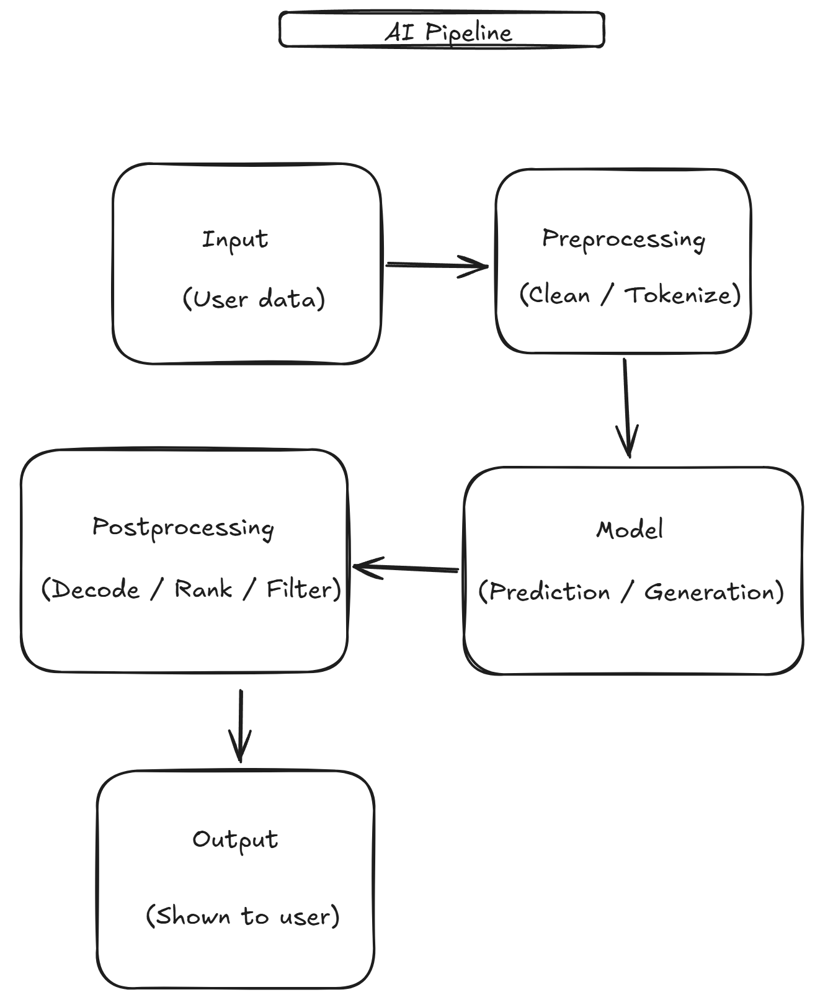

# AI 60 Days Coding Challenge

# Day 1 – Understanding AI Pipelines
## 1. AI Pipeline Diagram

## 2. Real-World AI Products
- ChatGPT: text → tokens → LLM → text → reply
- Google Translate: sentence → tokenize → translation model → fix grammar → translation
- Spotify: listening history → features → recommender → ranking → playlist

## 3. How a Chatbot Works
A chatbot takes the user's message as text input. The text is broken into tokens and converted into numbers. A trained language model predicts the most likely next words one token at a time. Those tokens are converted back into readable text and filtered before being shown. The conversation history is sent along with each new message so the chatbot stays in context.

## Day 2 – Python Basics
Colab notebook: [Day2_Python_Basics.ipynb](Day2_Python_Basics.ipynb)
- Cell 1: First Python cell
- Cell 2: Word frequency counter
- Cell 3: Text cleaning (lowercase, remove punctuation, normalize spaces)

## Day 3 – Text Preprocessing
Notebook: [Day3_Text_Preprocessing.ipynb](Day3_Text_Preprocessing.ipynb)
- Tokenization with NLTK
- Stop word and punctuation removal
- Bag-of-words representation
- Datasets: preprocessed_text.csv, preprocessed_bow.csv
